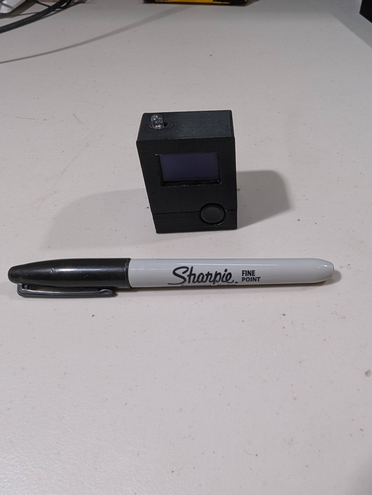

  
   

# Desk Buddy

Desk buddy is the combination of a cheap, simple interface (a button, a SSD1306 128x64 OLED display, a LED, a ESP32-C3, and a 3D printed case. ~$11 total) and complex software (I call it BuddyOS on-device, a companion react app, and a python flask API to drive everything) to create a customizeable desktop display with games and apps. Current feature list includes:

- Guided on-device setup to connect desk buddies to wifi and create an account
- Remote software updates to provide ongoing updates, features, and apps to deployed desk buddies
- Abstraction of buddy software into [Activities](micropython/activity.py) to simplify development of new software
- Ability to send messages to other desk-buddies through the companion app and a notification system to view them on-device
- flappybuddy game

## BOM

Want to build your own desk buddy?

- White SSD1306 128x64 Display 5x for $14.99. ~$3.00 ea. [Link](https://www.amazon.com/Hosyond-Display-Self-Luminous-Compatible-Raspberry/dp/B09T6SJBV5?crid=1D31P8BOLVBD6&dib=eyJ2IjoiMSJ9.dGpNnaoLmaI5GtTpnRUz1hNI-TVp7vY8g9LeP5v5gQ8ZlJTvFN0EskljvYdHhajmNHJTQXsZw-wX65OYtYte_baPhGsQLuqagyIAH-YycXatrbTX0x79sJs0F7N68tjjPVeAVcClA3QS0w_I5GIEo675WK67PL0Oas01CyZhKe4sKlTUUpMp_B2h2MwkjLOcUSoIBiHRV5fPkZkYw35Ns4OuyEku7g9NMN_qkbhGiaE.2MmDJ8X2wHrLXPKN5HOFn8PgaUyS_8agjM1t6aW1RYc&dib_tag=se&keywords=ssd1306&qid=1735441458&sprefix=ssd1306%2Caps%2C185&sr=8-3&th=1)
- 5mm LED 100x for $5.99. $0.06 ea. (any color) [link](https://www.amazon.com/Transparent-Lighting-Electronics-Components-Emitting/dp/B01AUI4VVA?crid=2JCMENLUG7IVI&dib=eyJ2IjoiMSJ9.JtrtGghjV-GQ8SD28HidckV4szrNmMJm6olSJGZehClved7zIdEQQC_ZDC8aMtEQMuQsee76zVePZbV0ipVeZF31QWG70xuLNmiv5SOWPzGqK43I81v2qse-eySWDeJxE5pzGwRo-lDXc-s2WDuFXClqj4IAKVN1MIOeLfE-ehU1mz19EOAFwhQd0EKaR7JjsELx9zPTIwX75O9wk4G7y7GK0iEHOZcqWHL2XayiRhU.3nNLTyY4VaNEbQEgDPJEAmY8Z4KqGYrmkqcx-hboSuQ&dib_tag=se&keywords=green%2Bleds&qid=1735441990&sprefix=green%2Ble%2Caps%2C171&sr=8-3&th=1)
- Seeed Studio XIAO ESP32C3 3x for $19.99. $6.66 ea. [link](https://www.amazon.com/dp/B0DGX3LSC7?ref=nb_sb_ss_w_as-reorder_k0_1_8&amp=&crid=3G2KFUV7WOC6V&sprefix=esp32%2Bc3&th=1)
- A momentary push button, I went with the spendy 10x for $11.99. $1.20 ea. [link](https://www.amazon.com/dp/B0CS6T4P82?ref=ppx_yo2ov_dt_b_fed_asin_title&th=1)
- You will also need (that you probably have laying around)
  - Wire (thin, ~24 AWG) to wire everything directly or use pre-made dupont jumper cables
  - A 330 ohm resistor (or so) for the LED

Total cost: $3.00 display + $0.06 LED + $6.66 ESP32C3 + $1.20 button = $10.92

## Thanks

This project uses [my fork](https://github.com/michaelosbornegit/packed-font) expanding on Mark Gladding's excellent SSD1306 font display library [packed-font](https://github.com/mark-gladding/packed-font). If I didn't discover his work I would have had to spend a very long time making different font sizes work, and it certainly wouldn't have worked as well.

## Contributing

Issues and development tasks are tracked on [github projects](https://github.com/users/michaelosbornegit/projects/2). Any contributions to the Desk Buddy project are greatly appreciated.

### Local Development Setup

### Easy (dev container)

This repository uses a VS Code Dev Container and nix for easy environment setup, this is the recommended way to run this locally:

#### app and server

1. Install Docker
1. Install the [Dev Containers](https://marketplace.visualstudio.com/items?itemName=ms-vscode-remote.remote-containers) VS Code extension
1. Now, when you open this folder in VS Code, you should see a prompt in the lower right to "Reopen in Dev Container", click on it. Or do `ctrl + shift + p` and type in "Dev Containers: Reopen in Dev Container"
1. Make sure you wait until installation is complete, the terminal will say "Done" when it is done.
1. Open a terminal to install app dependencies `cd app && npm install`
1. Set up environment files, copy app/.env-example and server/.env-example to app/.env and server/.env, generate new values for everything that says GENERATE ME and update all placeholders. Ensure secrets are consistent on the server for the app and on the app for the server.

#### BuddyOS

1. If your ESP32C3 doesn't have micropython on it, google how to install it.
1. Open a new instance of Visual Studio code at this folder, don't reopen it in the dev container, because the MicroPico extension doesn't work in a dev container
1. Make a copy of `micropython/secrets-example.py` and call it `micropython/secrets.py` and replace the values. Make sure you replace the DEVICE_SECRET with the same value you generated on the server with the same name. You can generate your own device_id and pairing_code, make sure to keep the pairing code short, something roughly 8 characters long.
1. Install the [MicroPico VS Code extension](https://marketplace.visualstudio.com/items?itemName=paulober.pico-w-go)
1. `ctrl + shift + p` and search and execute `MicroPico: Connect`, then do `MicroPico: Upload project to Pico`, then open `main.py` and do `MicroPico: Run current file on Pico`
1. Note that you must have the server running, and to make any edits to any files other than `main.py` in the micropython in the window open in the dev container, since DeskBuddy downloads the files from the server, it will overwrite any changes you make in the other window.

### Manual (without dev container)

1. Follow the above steps but install nix and direnv beforehand

or

1. Install nodejs 22 and [uv](https://github.com/astral-sh/uv), then follow the steps above.
